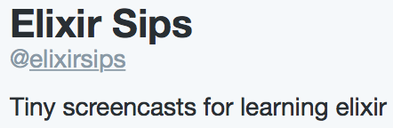

---
<!-- ######################################################################## -->

# Elixir: love at first sip

???

I thought I was being clever by using the word "sip" in the talk title since the
language is called Elixir. Well, I wasn't.


---
<!-- ######################################################################## -->





---


???

My name is Andrea Leopardi.

I'm a recent CS graduate and I work on the web.

---

???

Today I'm going to tell you about Elixir.


---
<!-- ######################################################################## -->

# Elixir

Programming language that runs on the Erlang VM


---
<!-- ######################################################################## -->

> Elixir is a dynamic, functional language designed for building scalable and
> maintainable applications.

--

Nice!

???

I could have come up with a nice pitch for Elixir, but I'm lazy and the Elixir
website already has one.

So, let's briefly see what that means.


---
<!-- ######################################################################## -->

# What does it look like

```elixir
defmodule Slugger do
  @doc "Slugs a string."
  @spec slufigy(String.t) :: String.t
  def slugify(str) do
    str
    |> String.downcase
    |> String.replace("'", "")
    |> String.replace(~/[?!,\-:;.]/, "-")
  end
end
```


---
<!-- ######################################################################## -->

# Dynamic

- Dynamically typed

```elixir
a = 1
b = "foo"
a = :gotcha
```


---
<!-- ######################################################################## -->

# Functional


---
<!-- ######################################################################## -->

Immutable data structures

```elixir
list = [:foo, :bar, :baz]

List.delete_at(list, 1)
#=> [:foo, :baz]

list
#=> [:foo, :bar, :baz]
```


???

Data structures in Elixir are just like Erlang data structures (actually, they
*are* Erlang data structures).


---
<!-- ######################################################################## -->

High-order functions

--

```elixir
sum = fn(n) ->
  fn(x) -> x + n end
end

add42 = sum.(42)
add42.(1)
#=> 43
```

--

```elixir
Enum.map [1, 2, 3, 4], fn(x) ->
  x * 3
end
#=> [3, 6, 9, 12]
```

???

Elixir functions are Erlang functions and Elixir modules are Erlang modules.


---
<!-- ######################################################################## -->

## Not *purely* functional

--

Side effects:

```elixir
iex> IO.puts "Hello world!"
Hello world!
:ok
```

--

Call-dependent results:

```elixir
iex> :erlang.now()
{1426, 179468, 348062}
iex> :erlang.now()
{1426, 179478, 386986}
```


---
<!-- ######################################################################## -->

# Scalable

```elixir
for _ <- 1..1_000_000 do
  spawn fn ->
    "hello"
  end
end
```

Thanks Erlang!


---
<!-- ######################################################################## -->

# Maintainable

- Nice syntax
- *Extremely* extensible (hint: macros!)
- Well documented


---
<!-- ####################################################################### -->

???

As I said, Elixir shares most of its features with Erlang. In the next part of
the talk, I will first highlight some of the great things that Elixir inherits
from Erlang, then I will focus on what Elixir brings to the table when compared
with Erlang.

I will skim over the basics (syntax, data types) and over the "classic"
functional features of the language, like:

- high-order functions
- immutable data structures

We're at a conference about functional languages after all!


---
<!-- ####################################################################### -->

# Pattern matching

`=` is not what it looks like.

--

```elixir
list = [1, 2, 3, 4]

[first, second|rest] = list

first  #=> 1
second #=> 2
rest   #=> [3, 4]
```

--

```elixir
tuple = {:my, 3, "elements", :tuple}

{:my, how_many, "ele" <> rest_of_the_string, :tuple} = tuple

how_many           #=> 3
rest_of_the_string #=> "ments"
```

???

`=` doesn't mean assignment, but it means pattern matching.

Similar to Haskell or ML.

Extremely useful in order to destructure complex data (and often only keep the
data we're interested in).

`=` can be used à-la-assignment because a "variable" matches anything and is
bounded to it.


---
<!-- ####################################################################### -->

```elixir
def do_action(:something) do
  something()
end

def do_action(:something_else) do
  something_else()
end
```

???

Pattern matching can be used in function heads.

This is extremely common in Erlang/Elixir for two reasons:

- it makes code much cleaner and easier to understand than when conditionals are
  used (since the spotlight is on the structure of the data) and it moves that
  logic "out" of the function
- it is very optimized by the Erlang VM

We will see an example of how we can take advantage of pattern matching later
on.


---
<!-- ####################################################################### -->

--

# Process


???

Compiling to Erlang code and running on the Erlang VM allows Elixir to leverage
all the power of Erlang itself.

Erlang allows to build very distributed, scalable and fault-tolerant
applications.

In Erlang, the basic unit of computation is the **process**.


---
<!-- ####################################################################### -->

???

If you understand how an Erlang process works, then you will see all the power
of this language.

The first thing to keep in mind is that *an Erlang/Elixir process is not an OS
process*. It is entirely handled by the VM, allowing processes to:

- be very lightweight
- behave consistently over different OSs

--

```elixir
pid = spawn fn ->
  IO.puts "Hello world!"
end
#=> #PID<0.61.0>
```


???

A process is created by **spawning** a function.


---
<!-- ####################################################################### -->

# Lightweight

```elixir
:timer.tc fn ->
  Enum.each 1..100_000, fn(_) ->
    spawn(fn -> :foo end)
  end
end
#=> {1735741, :ok}
```

That's about **1.7s** for 100k spawned processes!


???

Processes are **extremely** lightweight.

(*Don't mind the syntax, we will briefly talk about it later on*)

{Show that code in the console}


---
<!-- ####################################################################### -->

# Sending messages

```elixir
pid = spawn fn ->
  :timer.sleep 20_000
end

send pid, "Hello!"
#=> "Hello!"
```


???

Processes cannot share memory. The only form of communication between processes
is through *asynchronous* message passing.

You can *send* a process some message by using the primitive `send/2` passing
the pid of the process. Sending is *asynchronous*, and `send/2` will always
return the second argument passed to it.

Messages send to a process are guaranteed to be delivered to that process, and
they end up in that process' **message queue**.


---
<!-- ####################################################################### -->

# Receiving messages

```elixir
pid = spawn fn ->
  receive do
    {from, :hello} -> send from, {self(), "Hello to you!"}
    {from, :bye}   -> send from, {self(), "Bye bye!"}
    _              -> send from, {self(), "Eh?"}
  end
end
```

--

```elixir
send pid, {self(), :hello}
#=> {#PID<0.79.0>, :hello}
```

--

```elixir
receive do
  {_from, message} -> "Response: #{message}"
end
#=> "Response: Hello to you!"
```

???

To receive a message, a process has to use the `receive` construct. Receiving
messages is *blocking*.

When a process calls `receive`, the first message in the queue that matches one
of the patterns is removed from the queue. If no messages are in the queue, the
process waits for one (with a configurable timeout).


---
<!-- ####################################################################### -->

```elixir
defmodule Actor do
  def start(initial_state) do
    spawn fn -> loop(initial_state) end
  end

  def get(pid) do
    send pid, {:get, self()}
    receive do
      state -> state
    end
  end

  def put(pid, state) do
    send pid, {:put, self(), state}
  end

  def loop(state) do
    receive do
      {:get, from} ->
        send(from, state)
        loop(state)
      {:put, from, new_state} ->
        loop(new_state)
    end
  end
end
```

```elixir
actor = Actor.start(1)
Actor.set(actor, 2)

Actor.get(actor)
#=> 2
```

???

With just these constructs, we can easily implement fairly complicated
things. For example, the implementation of something akin to the actor model can
fit in a slide.


---
<!-- ####################################################################### -->

Nothing happens to the current process:

```elixir
spawn fn ->
  raise "dead :("
end
```

--

The exception is *propagated* to the current process:

```elixir
spawn_link fn ->
  raise "die with me!"
end
```

--

The current process is *notified* of the failure:

```elixir
spawn_monitor fn -> might_fail() end

receive do
  {:DOWN, _ref, :process, _pid, _reason} ->
    spawn_monitor fn -> might_fail() end
end
```

???

The other thing that makes Erlang processes so powerful is error handling.

When you spawn a process and that process dies abnormally (e.g., unhandled
exception) nothing happens to the parent process.

In order to propagate the error processes have to be **linked**. Links work
bilaterally.

If you want to only be notified when a process dies (unilaterally), then
**monitors** are the answer. This is extremely useful when you want to have a
process that monitors other processes and restarts them when they fail.


---
<!-- ####################################################################### -->

# Let it crash!

???

This brings us to an important phylosophy encouraged by Erlang: **let it crash**.

When something is going wrong with a computer, one of the easiest thing to do is
to simply *reboot* it: bring it back to an initial known initial state.

Erlang encourages to do the same thing: when a process fails, instead of trying
to fix the mess, just restart it in order to bring it back to a known initial state.


---
<!-- ####################################################################### -->

Ah, like CoffeeScript for JavaScript

NO

More like Clojure for Java

???

So, Elixir inherits a lot of its power from Erlang. At this point, one could
argue that Elixir is like CoffeeScript for JavaScript.

It's very similar to what Clojure is for Java.

In the rest of the talk, we will talk about what makes Elixir great and why it's
an extremely valid choice over Erlang.


---
<!-- ####################################################################### -->


# Interop

--

Erlang

```erlang
random:uniform().
%=> 0.4435846174457203
```

--

Elixir

```elixir
:random.uniform
#=> 0.4435846174457203
```

???

It's so easy to use Erlang from Elixir that it's almost ridicolous.


---
<!-- ####################################################################### -->

# Interop

--

Erlang

```erlang
lists:map(fun(El) -> El + 2 end, [1, 2, 3]).
%=> [3, 4, 5]
```

--

Elixir

```elixir
:lists.map(fn(el) -> el + 2 end, [1, 2, 3])
#=> [3, 4, 5]
```


---


---

# Homoiconicity

> In a homoiconic language the primary representation of programs is also a data
> structure in a primitive type of the language itself.


---

# Quoting

???

How does quoting work? It's very similar to languages like Lisp. You quote an
expression and that expression is not evaluated: its AST is returned. If you
want to inject values from the outer context into a quoted expression, you just
**unquote** those values (just like you would do in Lisp).

Small example:

```elixir
quote do
  foo(1, 2)
end
#=> {:foo, [], [1, 2]}
```

`{:foo, [], [1, 2]}` looks very similar to a possible Lisp analogous, `(foo 1 2)`.


---

# Macros

???

Macros are wrappers around quoting: a macro receives its arguments as an AST (as
if they had been quoted before having been passed to the macro) and must return
a quoted expression (an AST). *That expression is executed in the caller's
context, immediately*.


---

# Demo time!

???

Dataset:
https://dspl.googlecode.com/hg/datasets/google/canonical/currencies.csv


---

???

One point I want to stress: why using Elixir instead of Erlang?

Using Elixir, you get all the power of Erlang (all the nice things like
lightweight processes, fault-tolerance, low latency and so on) with in addition:

* Homoiconicity (and thus macros)
* Nicer syntax
* Easy string/binary manipulation (instead of binaries/charlists in Erlang)
* Lots of cool new libraries

At the same time, however, you're really not giving up anything: Elixir has
direct access to **everything** in the Erlang VM: you can use modules, functions
and data structures from Erlang. Say you don't trust Elixir's `String` module:
just call functions from the `:binary` module and you're fine.

You could write Elixir code using only Erlang stuff, and you could still gain
from macros and nicer syntax. It would still be worth it.
